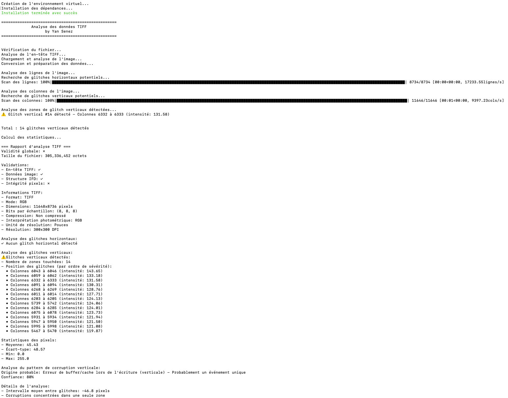

# TiffAnalyzer

TiffAnalyzer is a tool quickly designed following an issue encountered by a client to analyze TIFF files and detect anomalies such as data corruption, horizontal or vertical glitches, and other potential issues, while attempting to determine their origins. It combines a Python script for file analysis with a Bash script that facilitates installation and execution within a virtual environment. This project is still in development, and no guarantee is provided regarding the accuracy of the results at this stage (but for me, it worked to separate corrupted TIFFs from others and determine the source of the problem).  
The detection thresholds are probably not universal; I am working on a dynamic thresholding method.

## Features
- Detailed analysis of TIFF files to validate their integrity.
- Detection of horizontal and vertical glitches, with identification of corruption patterns.
- Comprehensive report on detected anomalies, including severity and location.
- Automatic creation and management of a Python virtual environment for easy setup.

## Prerequisites
- Python 3.x
- Python modules: `Pillow`, `numpy`, `scipy`, `tqdm`
- Bash (to execute the launch script)

## Installation
1. Clone this repository:
    ```bash
    git clone https://github.com/Igrekess/tiffanalyzer.git
    cd tiffanalyzer
    ```

2. Ensure that Python 3 is installed on your system:
    ```bash
    python3 --version
    ```

3. Grant execution permissions to the Bash script:
    ```bash
    chmod +x analyse.sh
    ```

## Usage
To analyze a TIFF file, simply run the Bash script:
```bash
./analyse.sh <path-to-the-file.tiff>
```
The script:

- Checks for the file's existence and format.
- Automatically sets up a Python virtual environment if necessary.
- Runs the analysis using the `analyse_tiff.py` script.

### Results
The analysis results are displayed directly in the console, with detailed information on any detected corruptions.

#### Example
```bash
./analyse.sh example.tiff
```


## Project Structure
- `analyse_tiff.py` : The main Python script for analyzing TIFF files.
- `analyse.sh` : The Bash script for simplified installation and execution.
- `README.md` : Project documentation.

## License
This project is licensed under the MIT License. See the LICENSE file for more details.


--------------------------
#French Version

# TiffAnalyzer

TiffAnalyzer est un outil rapidement conçu suite à un problème rencontré par un client pour analyser des fichiers TIFF et détecter des anomalies telles que les corruptions de données, les glitches horizontaux ou verticaux, et d'autres problèmes potentiels et tenter de déterminer leurs origines. Il combine un script Python pour l'analyse des fichiers avec un script Bash facilitant l'installation et l'exécution dans un environnement virtuel. Ce projet est en cours de développement, aucune garantie sur la validité des résultats n'est fournis à ce stade (mais pour moi ça a fonctionné pour trier les tiffs corrompues des autres, et déterminer l'origine du problème).
Les seuils de détections ne sont probablement pas universels, je travaille à une méthode dynamique des seuils.


## Fonctionnalités
- Analyse détaillée des fichiers TIFF pour valider leur intégrité.
- Détection des glitches horizontaux et verticaux, avec identification des patterns de corruption.
- Rapport complet des anomalies détectées, incluant leur sévérité et localisation.
- Création et gestion automatique d'un environnement virtuel Python pour une configuration simplifiée.

## Prérequis
- Python 3.x
- Modules Python : `Pillow`, `numpy`, `scipy`, `tqdm`
- Bash (pour exécuter le script de lancement)

## Installation
1. Clonez ce dépôt :
    ```bash
    git clone https://github.com/Igrekess/tiffanalyzer.git
    cd tiffanalyzer
    ```

2. Assurez-vous que Python 3 est installé sur votre système :
    ```bash
    python3 --version
    ```

3. Donnez les permissions d'exécution au script Bash :
    ```bash
    chmod +x analyse.sh
    ```
## Utilisation
Pour analyser un fichier TIFF, exécutez simplement le script Bash :
```bash
./analyse.sh <chemin-vers-le-fichier.tiff>
 ```
Le script :

    Vérifie l'existence et le format du fichier.
    Configure automatiquement un environnement virtuel Python si nécessaire.
    Lance l'analyse avec le script Python analyse_tiff.py.

Résultats

Les résultats de l'analyse sont affichés directement dans la console, avec des informations détaillées sur les éventuelles corruptions détectées.
Exemple

./analyse.sh example.tiff

Structure du projet

    analyse_tiff.py : Le script Python principal pour l'analyse des fichiers TIFF.
    analyse.sh : Le script Bash pour l'installation et l'exécution simplifiée.
    README.md : Documentation du projet.

Licence

Ce projet est sous licence MIT. Consultez le fichier LICENSE pour plus de détails.

